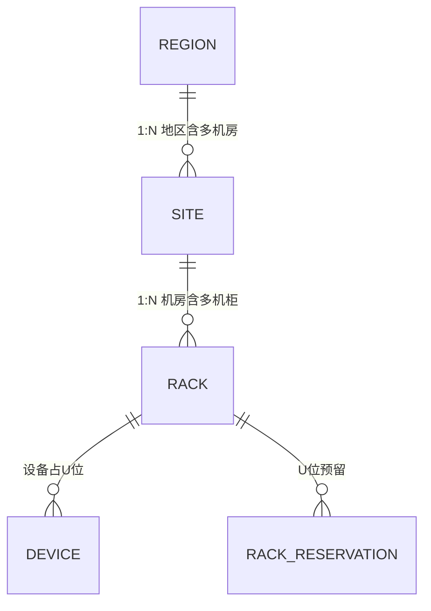
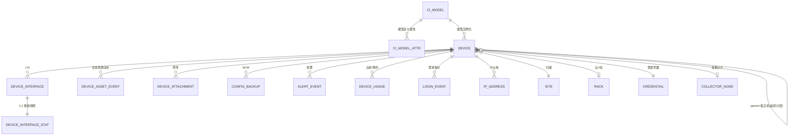
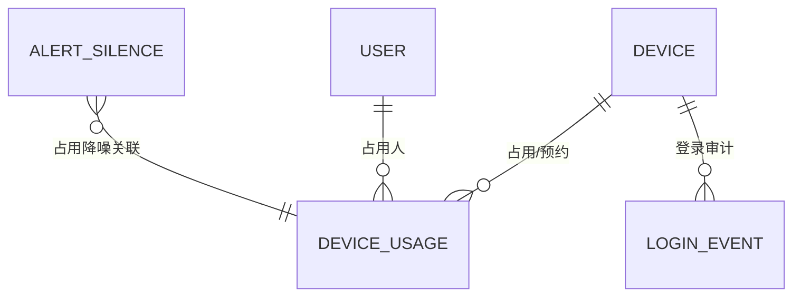

# 智能运维 CMDB 平台 - 数据库 ER 设计

| 文档信息 | 内容 |
|---|---|
| 文档版本 | V1.1（评审修订版：DeepSeek-V4-Flash 独立评审 30 项意见已全部处置，见文末评审记录） |
| 配套文档 | PRD-智能运维CMDB平台.md（V0.5） |
| 技术栈 | PostgreSQL 16 + Django 5/DRF + VictoriaMetrics + Redis + MinIO |
| 设计范围 | 全部 P0/P1 模块的持久化模型；P2 模块给出表骨架 |

---

## 1. 设计总则

| 约定 | 说明 |
|---|---|
| 命名 | 表/字段 snake_case；表名不带 app 前缀（Django App 即逻辑域）；视图 `v_` 前缀 |
| 主键 | `bigint` 自增（Django BigAutoField），分布式采集数据不依赖 DB 自增 |
| 时间 | 一律 `timestamptz`，**UTC 存储**（PRD 12.2-15），前端本地化展示 |
| 逻辑删除 | 核心业务表带 `deleted_at timestamptz`（唯一索引均为 partial：`WHERE deleted_at IS NULL`） |
| 审计字段 | `created_at / created_by / updated_at / updated_by` 全表通用（下文省略不再重复列出） |
| 动态属性 | `ci_model_attr`（定义）+ `device.attrs` JSONB（取值），GIN 索引 |
| 敏感字段 | `*_encrypted` 后缀，AES-256-GCM 加密存储，密钥来自环境变量/KMS，数据库泄露不可逆推明文 |
| 枚举 | Django TextChoices；DB 层 `varchar + CHECK` 约束 |
| 大文本/文件 | 配置备份、报告、命令回显、附件一律存 MinIO，表内只存 URL 与元数据 |
| 指标与日志 | 指标历史全部进 VictoriaMetrics（不进 PG）；日志起步用 PG 分区表，量大迁 ClickHouse |

## 2. 存储分层

| 数据类别 | 存储 | 关键设计 |
|---|---|---|
| 主数据 / 事务数据 | PostgreSQL | 本文档 |
| 指标时序（全部） | VictoriaMetrics | **统一 label 规范：`device_id`、`if_name`、`driver_type`、`site_id`**（SNMP 采集与 Prometheus remote_write 双源同规范，此为网络设备与服务器指标统一查询的锚点） |
| 最新快照（供列表页） | PostgreSQL | `device.online_status`、`device_interface_stat` 采集器每轮 upsert，历史在 VM |
| 文件 | MinIO | 配置备份 / 巡检报告 / 附件 / 命令回显，按 `bucket/日期/device_id` 组织 |
| 原始日志 / 登录事件 | PostgreSQL 按月分区 | `log_record`、`login_event`、`audit_log`；保留策略见第 7 章 |
| 缓存 / 队列 | Redis | Celery broker、采集配置下发缓存、告警通知去重窗 |

## 3. 表清单总览（按 Django App 分域，共 80 张表 + 4 视图；V1.1 清点修正）

| App | 表 | 说明 | 特殊标注 |
|---|---|---|---|
| dcim | region | 地区（一级） | |
| dcim | site | 机房/站点（二级） | |
| dcim | rack | 机柜（42U/47U/50U 自定义） | |
| dcim | rack_reservation | U 位预留 | |
| dcim | cable | 线缆台账（接口级连线，含 LLDP 辅助生成） | |
| topo | lldp_neighbor | LLDP/CDP 实测邻居（原始数据） | 与 cable 比对 |
| topo | topology | 拓扑图（自定义视图） | |
| topo | topology_node | 拓扑节点（布局坐标） | |
| topo | topology_edge | 拓扑自定义边 | |
| cmdb | ci_model | 设备类型（动态模型） | |
| cmdb | ci_model_attr | 模型自定义属性定义 | is_auto/is_locked |
| cmdb | device | **设备台账（核心表）** | U 位排他约束 |
| cmdb | device_group / device_group_member | 静态/动态设备分组 | 动态组 filter 为 JSONB |
| cmdb | device_interface | 设备接口（清单） | |
| cmdb | device_interface_stat | 接口最新指标快照 | 采集器 upsert |
| cmdb | device_attachment | 附件（照片/合同/手册） | URL 存 MinIO |
| cmdb | device_asset_event | 资产生命周期事件流水（含借用/归还） | |
| cmdb | license | License/维保/合同（12.2-3） | key 加密 |
| cmdb | wireless_ap_info | AP 明细（WLC 同步） | |
| cmdb | route_table_snapshot / routing_neighbor | 路由表快照与 OSPF/BGP 邻居（PRD 5.5.4） | V1.1 评审新增 |
| cmdb | business / device_business | 业务系统与设备依赖关系 | V1.1 评审新增；拓扑业务子图 |
| monitor | collector_node | 采集器实例（分片节点） | |
| monitor | prometheus_target | Prometheus target ↔ CI 关联 | |
| monitor | log_record | 设备日志（syslog/CLI 抓取） | **按月分区** |
| monitor | terminal_session / terminal_command | 平台内 CLI 会话审计 | 回显存 MinIO |
| usage | device_usage | 占用/预约记录（5.17.1） | 时间窗排他约束 |
| usage | login_event | 登录审计 LoginEvent（5.17.3） | **按月分区** |
| alert | alert_rule | 告警规则（阈值/状态/日志） | |
| alert | alert_event | 告警事件（含巡检触发） | **dedup_key** |
| alert | alert_notification | 通知发送记录 | |
| alert | alert_silence | 静默/维护窗口/占用降噪 | |
| alert | alert_escalation_rule | SLA 升级策略 | |
| inspect | inspect_template / inspect_item | 巡检模板/检查项 | |
| inspect | inspect_task | 定时巡检任务 | |
| inspect | inspect_run / inspect_run_device / inspect_result | 执行/单设备汇总/明细 | 报告存 MinIO |
| ncm | config_backup | 配置备份版本 | sha256 去重 |
| ncm | config_change_event | 配置变更事件 | |
| ncm | baseline_rule / baseline_check_result | 安全基线 | |
| ipam | vlan / subnet / ip_address | VLAN/网段/IP | |
| automate | script | 脚本/命令模板库 | |
| automate | approval | 通用审批单 | 多业务复用 |
| automate | script_run / script_run_detail | 执行记录/逐台明细 | |
| automate | job / job_run | 任务编排（P2 骨架） | |
| automate | firmware_upgrade_plan | 固件升级作业计划（P2 骨架） | V1.1 评审新增 |
| change | change_ticket | 轻量变更单（12.2-5） | |
| change | incident_ticket / incident_event | 事件单及其时间线（11.1-14） | |
| system | org_dept / user_profile | 组织/用户扩展（飞书绑定） | |
| system | role / permission / role_permission / user_role / role_data_scope | RBAC + 数据权限 | |
| system | credential | 凭据保险箱 | **全字段加密** |
| system | notify_channel | 通知渠道（飞书/邮件…） | |
| system | api_token | API Token（含 AI 只读） | hash 存储 |
| system | audit_log | 平台操作审计 | **按月分区，只追加** |
| system | system_config | 系统参数 | |
| system | duty_schedule | 值班排班（P2） | |
| system | data_import_job | Excel 导入任务与校验回执 | V1.1 评审新增 |
| system | webhook_subscription | Webhook 事件订阅（P2） | V1.1 评审新增 |
| ai | llm_config | LLM 网关配置（newapi） | api_key 加密 |
| ai | prompt_template | Prompt 模板 | |
| ai | ai_invocation | 调用记录（用量/成本） | |
| ai | knowledge_doc | RAG 知识库文档元数据 | |
| report | report_task / report_instance | 定时报表任务/产出 | |

---

## 4. 分域详细设计

### 4.1 位置域（dcim）—— 地区 -> 机房 -> 机柜

**region 地区（一级，PRD 11.1-9）**

| 字段 | 类型 | 说明 |
|---|---|---|
| id | bigint PK | |
| parent_id | bigint FK(region) NULL | 预留树形扩展（当前仅一级使用） |
| name | varchar(64) | 地区名，如"华东" |
| code | varchar(32) UNIQUE | |
| manager_id | bigint FK(user) | 地区负责人 |
| remark | varchar(255) | |

**site 机房/站点（二级）**

| 字段 | 类型 | 说明 |
|---|---|---|
| id | bigint PK | |
| region_id | bigint FK(region) NOT NULL | 所属地区 |
| name / code | varchar(64) / varchar(32) UNIQUE | |
| address | varchar(255) | |
| manager_id | bigint FK(user) | 机房责任人 |
| contact / contact_phone | varchar(64) / varchar(32) | |
| bandwidth_mbps / isp | int / varchar(64) | 出口带宽与运营商 |
| remark | varchar(255) | |

**rack 机柜**

| 字段 | 类型 | 说明 |
|---|---|---|
| id | bigint PK | |
| site_id | bigint FK(site) NOT NULL | |
| name | varchar(64) | 如 A01；UNIQUE(site_id, name) |
| row_no / col_no | varchar(8) | 行列位置 |
| u_total | smallint NOT NULL | 总 U 数：42/47/50 自定义（CHECK 1~60） |
| rated_power_w | int | 额定电力（瓦） |
| rated_weight_kg | int | 额定承重 |
| remark | varchar(255) | |

**rack_reservation U 位预留（黄色 U 位）**

| 字段 | 类型 | 说明 |
|---|---|---|
| id | bigint PK | |
| rack_id | bigint FK(rack) | |
| start_u / units | smallint | 起始 U 与占用数，与 device 同样应用排他规则 |
| reason | varchar(255) | 预留原因（"扩容"） |
| expires_at | timestamptz NULL | 到期自动释放 |

约束（V1.1 评审 #1/#29）：`CHECK (units BETWEEN 1 AND 60)`；自身排他：`EXCLUDE USING gist (rack_id WITH =, int4range(start_u, start_u + units) WITH &&)`；**跨表互斥（预留 vs 设备占用）**：PG 不支持跨表 EXCLUDE，由 DeviceService 在上架/预留/换位时统一校验"同柜 U 区间不相交"，二期可评估统一槽位表方案（见 D2）。

### 4.2 CMDB 核心域 —— 动态模型与设备台账

**ci_model 设备类型（动态模型）**

| 字段 | 类型 | 说明 |
|---|---|---|
| id | bigint PK | |
| code | varchar(64) UNIQUE | firewall / switch / router / wlc / ap / sangfor_ac / server / vm / odf / pdu / ups / ont(光猫) / other |
| name | varchar(64) | 显示名 |
| category | varchar(32) | network / security / server / facility / wireless / other |
| default_u_height | smallint DEFAULT 1 | 新设备默认 U 高 |
| sn_required | bool | 无源设备（ODF 等）= false |
| manageable | bool | 是否纳管采集（server/vm 走 Prometheus，无源设备 false） |
| icon | varchar(64) | 前端图标标识 |

**ci_model_attr 模型属性定义（动态属性）**

| 字段 | 类型 | 说明 |
|---|---|---|
| id | bigint PK | |
| model_id | bigint FK(ci_model) | |
| code / name | varchar(64) / varchar(64) | 属性键 / 显示名；UNIQUE(model_id, code) |
| attr_type | varchar(16) | text / int / float / bool / enum / date / ip / json |
| enum_options | jsonb | attr_type=enum 时的可选值列表 |
| is_required / default_value | bool / varchar(255) | |
| **is_auto_collected** | bool DEFAULT false | 自动采集回填属性（PRD 5.5.6：采集值覆盖前校验 is_manual_locked） |
| **is_manual_locked** | bool DEFAULT false | 人工锁定后采集不覆盖 |
| sort | int | 表单排序 |

**device 设备台账（核心表）**

| 字段 | 类型 | 说明 |
|---|---|---|
| id | bigint PK | |
| sn | varchar(64) | 序列号，**主唯一标识**；无源设备为空 |
| asset_no | varchar(64) | 资产编号（人工），辅助唯一 |
| name | varchar(128) | 显示名（如"FW-出口-01"） |
| hostname | varchar(128) | 设备自身主机名（自动回填） |
| model_id | bigint FK(ci_model) NOT NULL | 设备类型 |
| vendor | varchar(64) | 品牌：H3C / Cisco / Fortinet / Sangfor / ... |
| hw_model | varchar(128) | 硬件型号：S6520X / FG-600F / 9800-L / 3504 ...（自动回填） |
| sw_version | varchar(64) | 当前系统版本（自动回填，版本一致性比对用） |
| manage_ip | inet NULL | 管理 IP |
| region_id | bigint FK(region) NOT NULL | 冗余存储（与 site_id 同步维护），支撑按地区筛选 |
| site_id | bigint FK(site) NOT NULL | 虚机填宿主机所在机房 |
| rack_id | bigint FK(rack) NULL | 虚机/未上架设备为空 |
| rack_start_u / rack_units | smallint NULL / smallint DEFAULT 1 | 占 U 位；CHECK rack_units 1~60 |
| **parent_device_id** | bigint FK(device) NULL | **虚机 -> 宿主机**（is_virtual=true 时有效） |
| **is_virtual** | bool DEFAULT false | 虚机/云主机标记（11.1-13） |
| vm_source | varchar(32) NULL | vcenter / cloud_api / manual |
| vm_uuid | varchar(128) NULL | 虚机实例 UUID（云同步幂等键） |
| usage_tag | varchar(16) DEFAULT 'prod' | prod / test / dev / shared（5.17.5） |
| shareable | bool DEFAULT false | 可共享开关 |
| lifecycle_status | varchar(16) DEFAULT 'deployed' | planning/purchasing/in_stock/deployed/repairing/spare/retired |
| **usage_status** | varchar(16) DEFAULT 'idle' | idle/occupied/reserved/maintenance_lock（**与 lifecycle 独立**，仅 test/dev/shared 设备生效，5.17.1） |
| online_status | varchar(16) DEFAULT 'offline' | online / offline / collect_error（最新快照，采集器 upsert） |
| last_seen_at | timestamptz NULL | 最近采集成功时间 |
| driver_type | varchar(64) NULL | 采集驱动：fortigate / cisco_asa / h3c_comware / cisco_wlc_3504 / cisco_wlc_9800 / sangfor_ac / snmp_std / node_prometheus |
| credential_id | bigint FK(credential) NULL | |
| collector_id | bigint FK(collector_node) NULL | 采集分片归属 |
| collect_enabled | bool DEFAULT true | |
| collect_interval_s | int DEFAULT 300 | 单设备采集周期（默认 5 分钟） |
| rated_power_w | int NULL | 额定功率（机柜电力统计用） |
| owner_user_id | bigint FK(user) | 责任人 |
| dept_id | bigint FK(org_dept) | 归属部门 |
| purchase_date / warranty_until | date NULL | 保修到期自动提醒 |
| supplier | varchar(128) | |
| **attrs** | **jsonb DEFAULT '{}'** | 动态属性值（键=ci_model_attr.code） |
| **locked_fields** | jsonb DEFAULT '[]' | 被人工锁定的**内置字段**名集合（如 `["hostname","sw_version"]`），采集回填前跳过（PRD 5.5.6，V1.1 评审 #13；自定义属性的锁定由 ci_model_attr.is_manual_locked 表达） |
| remark | text | |
| deleted_at | timestamptz NULL | 逻辑删除 |

约束与索引：
- `UNIQUE(sn) WHERE sn IS NOT NULL AND deleted_at IS NULL`
- `CHECK (rack_id IS NULL OR rack_start_u IS NOT NULL)`（有柜必有 U 位；rack_start_u+rack_units ≤ rack.u_total 的跨表校验由服务层执行）（V1.1 评审 #29）
- region_id 冗余维护纪律：与 site_id 在同一事务内由服务层写入，每日一致性校验任务兜底（V1.1 评审 #10）
- `UNIQUE(asset_no) WHERE deleted_at IS NULL`
- **U 位排他约束（机柜可视化冲突检测的 DB 级兜底）：**
  `EXCLUDE USING gist (rack_id WITH =, int4range(rack_start_u, rack_start_u + rack_units) WITH &&) WHERE (rack_id IS NOT NULL AND deleted_at IS NULL)`
- 索引：model_id、region_id、site_id、rack_id、driver_type、online_status、usage_tag、lifecycle_status、owner_user_id、parent_device_id、`GIN(attrs jsonb_path_ops)`；**全局搜索（PRD 5.1 P0）**：`GIN(sn gin_trgm_ops)`、`GIN(hostname gin_trgm_ops)`、`GIN(manage_ip::text gin_trgm_ops)`（需 `CREATE EXTENSION pg_trgm`，V1.1 评审 #7）
- 说明：hw_model/sw_version/hostname 等 is_auto 属性仍在 attrs JSONB 中保存一份完整采集值，列内为投影（列表筛选性能），以 ci_model_attr 定义对齐
- **attrs 查询约定（V1.1 评审 #11/#12）**：等值/包含筛选统一用 `@>`（Django 写法 `attrs__contains={"vendor": "H3C"}`，命中 jsonb_path_ops GIN）；**数值范围筛选（CPU<50%、内存≥8G）不走 attrs**，采用两段式：先查 VictoriaMetrics 得 device_id 集合、再回表过滤；确有高频范围筛选需求的数值属性用 PG 生成列（Django 5 GeneratedField）+ btree 索引

**device_group / device_group_member 设备分组**

| 字段 | 类型 | 说明 |
|---|---|---|
| device_group.id / name | bigint / varchar(64) | |
| group_type | varchar(8) | static / **dynamic**（动态组 filter JSONB 实时计算，不入 member 表） |
| filter | jsonb NULL | 动态组条件：`{"model": "switch", "region_id": 1, "attrs": {"vendor": "H3C"}}` |
| device_group_member | (group_id, device_id) 复合主键 | 仅静态组使用 |

**device_interface 设备接口**

| 字段 | 类型 | 说明 |
|---|---|---|
| id | bigint PK | |
| device_id | bigint FK(device) ON DELETE CASCADE | |
| name | varchar(64) | 如 GigabitEthernet1/0/24；UNIQUE(device_id, name) |
| if_index | int | SNMP ifIndex |
| if_alias | varchar(255) | 接口描述 description |
| media_type | varchar(32) | ethernet / fiber / ... |
| admin_status / oper_status | varchar(8) | up / down / testing（采集回填） |
| speed_bps | bigint | 协商速率 |
| duplex | varchar(8) | |
| vlan_ids | jsonb | 属于 VLAN 列表（trunk）；access 存单元素 |
| native_vlan | int NULL | |
| mac | macaddr NULL | |
| is_uplink | bool | 级联口标记 |
| flap_count / last_flap_at | int / timestamptz | 翻转计数（flapping 检测） |
| attrs | jsonb | 驱动私有字段 |

**device_interface_stat 接口最新指标快照（1:1）**

| 字段 | 类型 | 说明 |
|---|---|---|
| interface_id | bigint PK FK(device_interface) | 采集器每轮 upsert |
| in_bps / out_bps | bigint | 流量速率 |
| in_pps / out_pps | bigint | 包速率 |
| in_errors_total / out_errors_total | bigint | 累计错包（历史增量计算在采集器，速率存本表） |
| in_errors_rate / out_errors_rate | numeric(12,3) | 错包速率（增量/秒，**增量视图口径**，PRD 5.5.5） |
| in_drops_total / out_drops_total | bigint | 丢包 |
| broadcast_pps | bigint | 广播包速率 |
| optical_tx_dbm / optical_rx_dbm | numeric(5,2) NULL | 光模块收发光功率（光衰预警） |
| poe_watt | numeric(8,2) NULL | PoE 实时功率 |
| updated_at | timestamptz | 快照时间 |

> 历史曲线（1h/6h/24h/7d 流量图）一律查 VictoriaMetrics：`if_in_bps{device_id="...", if_name="..."}`。

**device_asset_event 资产生命周期事件流水（含借用/归还，12.2-1）**

| 字段 | 类型 | 说明 |
|---|---|---|
| id | bigint PK | |
| device_id | bigint FK(device) | |
| event_type | varchar(16) | purchase/in_stock/deploy/repair/borrow/return/spare/retire |
| occurred_at | timestamptz | |
| operator_id | bigint FK(user) | |
| counterparty | varchar(64) NULL | 借用人/归还人（借用场景） |
| detail | jsonb | 合同号、金额、原因等 |

**license（12.2-3）**

| 字段 | 类型 | 说明 |
|---|---|---|
| id / device_id | bigint / FK(device) | |
| license_type | varchar(64) | fortigate 授权 / wlc ap-seat / 维保合同 |
| key_encrypted | text | license key 或合同编号（加密） |
| seats / expire_at | int / date | 授权数 / 到期日（到期自动提醒，联动告警） |
| supplier / contract_no | varchar(128) / varchar(64) | |

**wireless_ap_info AP 明细（WLC 自动同步，3504 与 9800-L 双驱动写入同一结构）**

| 字段 | 类型 | 说明 |
|---|---|---|
| id | bigint PK | |
| device_id | bigint FK(device) UNIQUE | AP 作为设备纳管（ci_model=ap），此表存无线私有属性 |
| wlc_device_id | bigint FK(device) | 归属 AC（拓扑用） |
| ap_name / ap_ip | varchar(64) / inet | |
| ap_model | varchar(64) | |
| channel_2g / channel_5g | varchar(8) NULL | 信道 |
| tx_power | smallint NULL | 发射功率 |
| client_count | int | 当前客户端数 |
| uplink_switch_id | bigint FK(device) NULL | 上联交换机（由 LLDP/MAC 定位） |
| uplink_interface | varchar(64) NULL | 上联端口名 |
| status | varchar(16) | online / offline / rogue-suspect |
| synced_at | timestamptz | 同步时间（9800/3504 驱动统一 upsert） |

**device_attachment**：`(id, device_id FK, file_name, file_url, file_type[photo/contract/manual/warranty/other], size, uploaded_by)`。

**route_table_snapshot 路由表快照（V1.1 评审 #5，PRD 5.5.4）**

`(id, device_id FK, snapshot_at timestamptz, routes jsonb, route_hash varchar(64))`；route_hash 相同不新增快照（同 config_backup 去重思路）；变更对比为前后 routes 集合差（应用层 diff，新增/消失路由高亮）。索引：`(device_id, snapshot_at DESC)`、(route_hash)。

**routing_neighbor 路由协议邻居**

`(id, device_id FK, protocol[ospf/bgp], vrf varchar(32) NULL, neighbor_addr inet, neighbor_router_id varchar(32) NULL, state varchar(16), since timestamptz, last_seen_at)`；UNIQUE(device_id, protocol, neighbor_addr)；state 变化（如 Full -> Down）触发告警规则（rule_type=state）。

**business / device_business 业务依赖（V1.1 评审 #19，PRD 5.5.1 依赖关系 P0 + 5.9.2 业务子图）**

- business：`(id, name, code UNIQUE, owner_id FK(user), importance[critical/high/normal], remark)`--轻量业务系统台账
- device_business：`(id, business_id FK, device_id FK, role[core/member])`，UNIQUE(business_id, device_id)--拓扑按业务筛选子图、故障影响面分析、报表分组均基于此表

### 4.3 凭据域（system.credential，安全基座）

**credential 凭据保险箱**

| 字段 | 类型 | 说明 |
|---|---|---|
| id | bigint PK | |
| name | varchar(64) UNIQUE | 如 "H3C-核心交换机-SSH" |
| cred_type | varchar(16) | ssh_password / ssh_key / snmp_v2c / snmp_v3 / api_token |
| username | varchar(64) NULL | |
| secret_encrypted | text NOT NULL | 密码/私钥/community/token，AES-256-GCM 加密 |
| params | jsonb | `{"port":22,"auth_proto":"SHA","priv_proto":"AES","snmp_context":""}`；凭据使用审计记录引用本表 id |
| **scope** | jsonb DEFAULT '{}' | **凭据分组（PRD 5.3 P0，V1.1 评审 #2）**：`{"device_group_ids":[], "vendors":["H3C"], "models":["switch"]}`，按组/厂商/型号统一下发 |
| last_rotated_at / expire_at | timestamptz NULL | 轮换管理：到期经 Celery 扫描生成提醒告警（见第 8 章） |
| remark | varchar(255) | |

访问控制：凭据读取仅限采集引擎服务账号与授权角色；界面/接口永不返回明文（脱敏为 `****`）；每次使用写 audit_log（action=`credential_use`）。

凭据解析顺序（服务层，V1.1 评审 #2）：`device.credential_id`（单台覆盖）> 设备组默认（scope.device_group_ids）> 厂商/型号匹配（scope.vendors/models）> 全局默认；解析结果记入凭据使用审计。cred_type 枚举含 snmp_v1（PRD 第 6 章兼容声明，V1.1 评审 #20）。

### 4.4 监控采集域（monitor）

**collector_node 采集器实例（500+ 台分片架构）**

| 字段 | 类型 | 说明 |
|---|---|---|
| id | bigint PK | |
| name | varchar(64) UNIQUE | 如 "collector-sh-01" |
| region_id | bigint FK(region) | 部署地区 |
| address | varchar(128) | 采集器回调地址 |
| status | varchar(16) | active / offline / draining |
| capacity | int DEFAULT 300 | 纳管容量上限（建议 200~300 台/实例） |
| current_load | int | 当前分片设备数（心跳时上报） |
| last_heartbeat_at | timestamptz | 心跳超时 -> status=offline，触发降频接管 |

**prometheus_target Prometheus 关联（服务器/虚机指标复用）**

| 字段 | 类型 | 说明 |
|---|---|---|
| id | bigint PK | |
| device_id | bigint FK(device) | 服务器/虚机台账 |
| instance_label | varchar(128) | Prometheus `instance` 标签值（IP:9100 等） |
| job_label | varchar(64) | `node` / `blackbox` ... |
| last_scrape_at / last_scrape_ok | timestamptz / bool | 离线判定口径（12.3-3）：last_scrape 超 2 倍间隔且 ICMP 失败 |
| UNIQUE(device_id, instance_label) | | 一台设备多个 exporter 场景 |

**log_record 设备日志（按月分区）**

| 字段 | 类型 | 说明 |
|---|---|---|
| id | bigint（序列生成；**联合主键 PK(id, occurred_at)**，分区键必须包含在主键/唯一约束中，V1.1 评审 #8） | |
| device_id | bigint NULL | 未纳管设备日志也接收（按来源 IP 反查时回填） |
| source | varchar(16) | syslog / cli_pull |
| severity | smallint | 0~7（emerg~debug） |
| facility | varchar(32) | |
| message | text | 解析后的消息 |
| raw | text | 原始报文 |
| occurred_at | timestamptz | **分区键**：`PARTITION BY RANGE (occurred_at)` |

索引：(device_id, occurred_at)、(severity, occurred_at)、GIN(to_tsvector(message))（关键词检索）。

**terminal_session / terminal_command 平台内 CLI 会话审计**

- terminal_session：`(id, user_id FK, device_id FK, channel[web_cli/automation], started_at, ended_at, command_count)`
- terminal_command：`(id, session_id FK, command text, output_url, executed_at)`；回显超过 64KB 存 MinIO。

### 4.5 使用与共享域（usage，PRD 5.17）

**device_usage 占用/预约记录**

| 字段 | 类型 | 说明 |
|---|---|---|
| id | bigint PK | |
| device_id | bigint FK(device) | CHECK：目标设备 usage_tag IN ('test','dev','shared') |
| user_id | bigint FK(user) | 占用人 |
| usage_type | varchar(16) | reserve（预约）/ occupy（直接占用） |
| status | varchar(16) | reserved / active / released / expired / cancelled |
| planned_start / planned_end | timestamptz | 计划窗口（预约冲突检测依据） |
| actual_start / actual_end | timestamptz NULL | 实际占用/释放时间 |
| purpose | varchar(255) | 用途（项目/任务） |
| ticket_no | varchar(64) NULL | 关联审批单/工单号 |
| released_by / release_reason | bigint FK(user) / varchar(255) | 释放人（含管理员强制释放） |

约束：
- **预约/占用时间窗排他（同设备不重叠）：**
  `EXCLUDE USING gist (device_id WITH =, tstzrange(planned_start, planned_end) WITH &&) WHERE (status IN ('reserved','active'))`
- `CHECK (planned_start IS NOT NULL AND planned_end IS NOT NULL)`：直接占用（occupy）也必填计划窗口，避免 tstzrange(NULL,...) 逃逸排他约束（V1.1 评审 #14）
- 三处状态联动由 DeviceUsageService 统一驱动（同一事务）：创建预约/占用 -> `device.usage_status` 置 reserved/occupied + 创建 `alert_silence(silence_type='occupation')`；释放/过期 -> 回 idle + 结束静默
- 超时未释放：Celery 定时扫描 `status='active' AND planned_end < now()` -> 通知 + 标记 expired（业务层）。
- 占用开始时联动创建 `alert_silence(source='occupation')`，释放时结束。

**login_event 登录审计（按月分区，5.17.3）**

| 字段 | 类型 | 说明 |
|---|---|---|
| id | bigint（**联合主键 PK(id, login_at)**，分区键入主键，V1.1 评审 #8） | |
| device_id | bigint FK(device) | |
| username | varchar(64) | 设备侧账号名 |
| source_ip | inet | **远程源 IP**（多源合并主键之一） |
| login_at / logout_at | timestamptz / timestamptz NULL | **login_at 为分区键** |
| session_type | varchar(16) | ssh / console / web / api |
| result | varchar(8) | success / failed |
| source | varchar(16) | syslog / **jumpserver**（V0.5 主数据源，服务器）/ cli_pull（display users 周期抓取，网络设备）/ platform |

索引：(device_id, login_at)、(username, login_at)、(source_ip)。异常检测（P2）基于本表：同账号多源 IP、非内网段源、爆破计数。

> 共享资源池（5.17.4/5.17.5）不建实体表，以视图实现（见 4.11）。

### 4.6 告警域（alert）

**alert_rule**

| 字段 | 类型 | 说明 |
|---|---|---|
| id / name | bigint / varchar(64) | |
| rule_type | varchar(16) | metric_threshold / state / log_keyword / **trap**（SNMP Trap 规则，metric 字段填 Trap OID/名称，V1.1 评审 #6） |
| scope | jsonb | 目标范围：`{"device_group_ids":[], "models":[], "region_ids":[]}` |
| metric | varchar(128) | 指标名（VM 指标，如 `device_cpu_usage`）或状态键（offline/ha_state/power）或日志正则 |
| operator / threshold | varchar(8) / numeric | `> < >= <= == !=` 与阈值 |
| for_duration_s | int DEFAULT 300 | 持续时间（CPU>80% 持续 5 分钟） |
| severity | varchar(8) | critical / major / warning / info（对应 4 级） |
| log_pattern | varchar(512) NULL | rule_type=log_keyword 时的正则 |
| dedup_window_s | int DEFAULT 600 | 告警收敛窗口 |
| notify_channels / notify_users | jsonb / jsonb | 通知路由 |
| enabled | bool | |

**alert_event（监控告警与巡检异常共用，去重键设计）**

| 字段 | 类型 | 说明 |
|---|---|---|
| id | bigint PK | |
| **dedup_key** | varchar(128) | **去重键 = `f"{device_id}:{rule_id 或 inspect_item_id}"`**（PRD 12.2-14：巡检与监控共用事件表，天然去重） |
| rule_id / inspect_item_id | bigint FK NULL / bigint FK NULL | 触发来源二选一 |
| device_id / interface_id | bigint FK / bigint FK NULL | |
| severity | varchar(8) | |
| title / detail | varchar(255) / jsonb | |
| status | varchar(16) | firing -> acknowledged -> processing -> resolved -> closed |
| fired_count | int | 收敛窗口内触发次数 |
| first_fired_at / last_fired_at | timestamptz | |
| acked_by / acked_at | bigint FK / timestamptz | 认领 |
| resolved_at / closed_by / closed_at | | 闭环留痕 |
| suppressed_by_id | bigint FK(alert_event) NULL | 根因抑制：被抑制事件指向根告警 |
| process_note | text | 处理记录（追加式） |

约束：**`UNIQUE(dedup_key) WHERE status IN ('firing','acknowledged','processing')`**（活跃事件唯一，已关闭事件同键可再触发新事件）。
索引：(device_id, status)、(severity, status)、(first_fired_at)。

**alert_silence 静默/维护窗口/占用降噪（一表三用）**

`(id, scope jsonb, silence_type[maintenance/occupation], device_usage_id FK NULL, reason, started_at, ended_at, created_by)`

**alert_notification**：`(id, event_id FK, channel_id FK, target, status[queued/sent/failed], error, retry_count, sent_at, channel_msg_id varchar(64) NULL, interaction_status[pending/confirmed/handled/silenced] NULL, interaction_at NULL)`；channel_msg_id 支撑飞书卡片"确认/处理/静默"按钮回调的幂等回写（V1.1 评审 #18）。
**alert_escalation_rule**：`(id, severity, timeout_min, escalate_role_id, channel_ids jsonb, fired_count int DEFAULT 0, last_fired_at NULL)`（超时未确认升级，联动第 6 章 SLA；含执行留痕）。通知路由支持时间段：notify_channels 结构 `{"default":[1], "schedule":[{"period":"22:00-08:00","channels":[2]}]}`（V1.1 评审 #30）。

### 4.7 巡检域（inspect）

| 表 | 关键字段 | 说明 |
|---|---|---|
| inspect_template | id, name, description, enabled | 模板 |
| inspect_item | id, template_id FK, code, name, check_type[threshold/status_expect/script/composite], metric, operator, threshold_value numeric, expected_value varchar, script_command text, assert_keyword varchar(255), weight int, severity | 检查项；UNIQUE(template_id, code)；composite 类型按 weight 加权 |
| inspect_task | id, template_id FK, name, cron, scope jsonb, enabled, channel_ids jsonb, last_run_at | 定时任务 |
| inspect_run | id, task_id FK NULL, template_id FK, trigger_type[cron/manual], status[running/success/failed], started_at, finished_at, total_devices, abnormal_devices, health_score_avg numeric(5,2), report_url | 一次执行；报告 PDF 存 MinIO |
| inspect_run_device | (id, run_id FK, device_id FK, health_score, pass_count, warn_count, fail_count)，UNIQUE(run_id, device_id) | 单设备汇总 |
| inspect_result | (id, run_id FK, device_id FK, item_id FK, status[pass/warn/fail/skip], actual_value varchar(255), message text) | 明细；异常项由 Celery 转 alert_event（dedup_key 按检查项） |

### 4.8 拓扑域（topo）

**lldp_neighbor LLDP/CDP 实测邻居（自动发现原始数据）**

| 字段 | 类型 | 说明 |
|---|---|---|
| id | bigint PK | |
| local_interface_id | bigint FK(device_interface) | |
| source | varchar(8) | lldp（H3C）/ cdp（Cisco） |
| remote_chassis_id | varchar(128) | 邻居桥 MAC/机架号 |
| remote_hostname | varchar(128) | |
| remote_port_desc / remote_port_id | varchar(128) | 邻居端口 |
| remote_device_id | bigint FK(device) NULL | 匹配到已纳管设备时回填（按 hostname+port 或 chassis+port） |
| first_seen_at / last_seen_at | timestamptz | last_seen 超时 -> 邻居失效 |

UNIQUE(local_interface_id, remote_chassis_id, remote_port_id)。

**cable 线缆台账（与 LLDP 比对）**

`(id, a_interface_id FK, b_interface_id FK NULL, cable_type[cat5e/cat6/mm_fiber/sm_fiber/jumper], length_m numeric(8,2), path_desc varchar(255), source[manual/lldp/cdp], status[active/mismatch/planned/removed], last_seen_at, remark)`；UNIQUE(a_interface_id, b_interface_id)、`CHECK (a_interface_id < b_interface_id)`（连线方向归一化，防同一连线反序重复录入，V1.1 评审 #27）。

> 比对规则（PRD 5.4.4）：`cable(source='manual')` 存在但对应 lldp_neighbor 无记录 -> `status=mismatch`（台账线缆可能是错的）；LLDP 有而 cable 无 -> 提示补录。

**topology / topology_node / topology_edge 自定义拓扑图**

- topology：`(id, name, topo_type[physical_l2/l3/wireless/custom], auto_refresh bool, remark)`
- topology_node：`(id, topology_id FK, device_id FK, x numeric, y numeric, label varchar(64))`，UNIQUE(topology_id, device_id)
- topology_edge：`(id, topology_id FK, a_device_id FK, b_device_id FK, label, style jsonb)`，UNIQUE(topology_id, a_device_id, b_device_id)（V1.1 评审 #27）；自动边（LLDP 实时计算）不入库，渲染时叠加告警状态。

### 4.9 NCM 域（ncm）

**config_backup 配置备份版本**

| 字段 | 类型 | 说明 |
|---|---|---|
| id | bigint PK | |
| device_id | bigint FK(device) | |
| backup_type | varchar(16) | running / startup / full（FortiGate 全配置） |
| trigger | varchar(16) | scheduled / event / manual |
| file_url | varchar(512) | MinIO 路径；**文件内容 AES-256 加密后上传**（12.2-18 备份安全） |
| file_size | int | |
| file_hash | varchar(64) | sha256：**内容未变不新增版本**（备份去重，节省对象存储） |
| created_at | timestamptz | |

索引：(device_id, created_at DESC)、file_hash。

**config_change_event 配置变更事件**

`(id, device_id FK, detected_at, old_backup_id FK NULL, new_backup_id FK, changed_lines int, diff_url, related_alert_id FK NULL, related_ticket_id FK NULL, related_syslog jsonb)`——变更时间轴：变更行数、diff 文件、关联 syslog 与变更单。

**baseline_rule / baseline_check_result 安全基线**

- baseline_rule：`(id, name, rule_type[must_present/must_absent], pattern text(正则), scope jsonb, severity, remark)`
- baseline_check_result：`(id, rule_id FK, device_id FK, run_at, compliant bool, matched_content text)`

### 4.10 IPAM 域（ipam）

| 表 | 关键字段 | 说明 |
|---|---|---|
| vlan | id, vid smallint, name, site_id FK NULL（NULL=全局）, purpose, owner_id | UNIQUE 表达式索引 `(vid, COALESCE(site_id, 0))` |
| subnet | id, cidr cidr UNIQUE, vlan_id FK NULL, gateway inet, purpose, owner_id, site_id FK NULL | |
| ip_address | id, subnet_id FK, address inet, status[free/used/reserved/conflict], device_id FK NULL, interface_id FK NULL, mac macaddr NULL, assignee varchar(64), source[manual/arp_discover/dhcp], last_seen_at | UNIQUE(subnet_id, address)；ARP 自动发现与登记冲突 -> status=conflict 标红 |

> 网段格子图、冲突检测为查询/视图逻辑（`v_subnet_usage` 聚合每网段 used/free/conflict 计数）。

### 4.11 视图（供 5.17.4 联合检索与报表）

| 视图 | 定义要点 |
|---|---|
| v_available_device | device（usage_tag IN test/dev/shared，usage_status='idle'，online_status='online'，deleted_at IS NULL）JOIN device_interface_stat / prometheus_target 最新快照 -> "现在就能用的设备"组合检索（CPU<50%、内存可用等条件查 VM 后再回表，两段式查询） |
| v_share_pool | 共享池三态视图：空闲池 / 占用池 / 预约池（device LEFT JOIN device_usage active/reserved） |
| v_subnet_usage | 每网段已用/空闲/冲突/保留计数 |
| v_rack_capacity | 每机柜已用 U、电力合计（SUM(rated_power_w)）、设备数 |

### 4.12 自动化域（automate）

| 表 | 关键字段 | 说明 |
|---|---|---|
| script | id, name, category, script_type[cli_command/python/shell/ansible], content text, params_schema jsonb, danger_level[low/mid/high], enabled, created_by | 脚本库；高危脚本强制走审批 |
| approval | id, biz_type[script_run/change_ticket], biz_id, applicant_id, approver_id, status[pending/approved/rejected], comment, decided_at | **通用审批单**，多业务复用 |
| script_run | id, script_id FK, trigger[manual/schedule], executed_by, approval_id FK NULL, status[pending/approving/running/partial_success/success/failed/cancelled], scope jsonb, gray_batch jsonb（灰度批次）, started_at, finished_at, summary text | 批量执行 |
| script_run_detail | id, run_id FK, device_id FK, status, output_url, error text, executed_at | 逐台回显 |
| job / job_run（P2） | job: steps jsonb（步骤编排）；job_run: 执行实例 + 每步引用 script_run | 编排骨架 |
| firmware_upgrade_plan（P2） | id, device_ids jsonb, target_version, batch_config jsonb, window_start/end, rollback_version, status[planned/approved/executing/done/rolledback] | 固件升级作业计划骨架（12.2-4，V1.1 评审 #22） |

### 4.13 变更与事件域（change）

**change_ticket 轻量变更单（12.2-5，apps/change）**

| 字段 | 类型 | 说明 |
|---|---|---|
| id / ticket_no | bigint / varchar(32) UNIQUE | 如 CHG-20250101-001 |
| title / change_type | varchar(128) / varchar(16) | config / device / sw_upgrade / network |
| risk_level | varchar(8) | high / mid / low |
| plan_start / plan_end | timestamptz | 变更窗口（联动 alert_silence） |
| actual_start / actual_end | timestamptz NULL | |
| status | varchar(16) | draft -> approving -> approved -> implementing -> verifying -> closed / rejected / rolledback |
| applicant_id / implementer_id / verifier_id | bigint FK(user) | 申请/实施/验证分离 |
| content | jsonb | 变更内容与影响面 |
| related_script_run_id / related_config_event_id | bigint FK NULL | 与自动化执行、NCM 变更事件双向关联 |
| rollback_plan / result_desc | text | 回滚方案与验证结果 |

**incident_ticket / incident_event 事件单（11.1-14）**

- incident_ticket：`(id, ticket_no UNIQUE, title, source[manual/alert/inspect], reporter_id, handler_id, priority, status[new/assigned/processing/feedback/closed], related_alert_event_id FK NULL, device_id FK NULL, sla_deadline timestamptz, closed_at, description, resolution)`
- incident_event：`(id, ticket_id FK, event_type[comment/assign/status_change/sla_warning], actor_id, content, created_at)`——处理时间线。

### 4.14 系统域（system）

| 表 | 关键字段 | 说明 |
|---|---|---|
| org_dept | id, parent_id FK NULL, name, feishu_dept_id varchar(64) NULL, sort | 部门树；飞书同步锚点 |
| user_profile | id, user_id FK(auth_user) UNIQUE, feishu_unionid varchar(64) UNIQUE NULL, phone, dept_id FK, **login_fail_count int DEFAULT 0, locked_until timestamptz NULL, mfa_enabled bool DEFAULT false, mfa_secret_encrypted text NULL, password_expired_at date NULL, last_password_change date NULL** | 飞书 OAuth 绑定（二期 SSO）；登录安全字段支撑 PRD 5.2.1 P0（V1.1 评审 #4） |
| role | id, name, code UNIQUE, builtin bool | 预置：admin/net_ops/sys_ops/duty/readonly |
| permission | id, code UNIQUE（如 `cmdb.device.execute`）, name, menu, action[view/add/edit/delete/execute] | 菜单+按钮级 |
| role_permission / user_role | 复合主键关联表 | |
| **role_data_scope** | id, role_id FK, scope_type[all/region/site/**model**/device_group], scope_ref_id bigint NULL | **数据权限行级过滤**：Django ORM queryset 自动注入 `device.objects.filter(Q(region_id__in=...) | Q(site_id__in=...) | Q(model_id__in=...) | Q(...))`（model 维度对应 PRD 5.2.2"设备类型"隔离，V1.1 评审 #3） |
| audit_log | id, user_id, action[login/logout/create/update/delete/execute/credential_use/api_call], resource_type, resource_id, before jsonb, after jsonb, source_ip inet, created_at（**联合主键 PK(id, created_at)**） | **按月分区、只追加（REVOKE DELETE/UPDATE 逐分区执行）**；变更前后值 diff；**写入前对敏感字段（password/secret/community）统一脱敏**（V1.1 评审 #8/#24） |
| notify_channel | id, name, type[feishu/email/webhook/wechat/dingtalk/sms], config jsonb（飞书 webhook/app 凭据字段加密）, enabled | P0=飞书+邮件 |
| api_token | id, name, token_hash UNIQUE（sha256，明文仅创建时展示一次）, scopes jsonb, is_readonly bool, rate_limit_per_min int DEFAULT 60（AI 只读 Token，12.3-6）, expires_at, revoked_at, last_used_at, created_by | |
| system_config | key varchar(64) PK, value jsonb, description | 采集并发/超时/保留策略等 |
| duty_schedule | id, user_id FK, duty_date date, shift[primary/backup], region_id FK NULL, handover_note text NULL, handed_off_at timestamptz NULL | UNIQUE(user_id, duty_date, shift)；交接班记录（V1.1 评审 #23）；P2 |
| data_import_job | id, biz_type[device/rack_layout/interface], file_url, status[validating/running/partial/success/failed], total_cnt, success_cnt, fail_cnt, error_report_url, dedup_strategy[skip/update], created_by | Excel 批量导入任务与错误回执（PRD 5.5.2 P0，V1.1 评审 #17） |
| webhook_subscription | id, name, url, events jsonb, secret_encrypted, enabled, created_by | Webhook 事件订阅：设备上下线/告警/配置变更推送（PRD 5.16 P2，V1.1 评审 #21） |

### 4.15 AI 域（ai）

| 表 | 关键字段 | 说明 |
|---|---|---|
| llm_config | id, name, base_url varchar(255), api_key_encrypted text, model varchar(64), params jsonb, is_default bool, enabled | OpenAI 兼容端点（newapi），可配多模型分组 |
| prompt_template | id, scene[nl2query/root_cause/inspect_summary/risk_review/report/chatops], name, content text, variables jsonb, version int, enabled | 场景化 Prompt 管理 |
| ai_invocation | id, scene, user_id, model, prompt_tokens, completion_tokens, latency_ms, result_ref, created_at | 用量与成本统计；索引 (scene, created_at) |
| knowledge_doc | id, title, category[runbook/fault_case/manual], file_url, content text, chunk_count, status[indexing/indexed/failed], updated_at | RAG 语料元数据（向量存独立向量库，PG 存元数据+全文索引） |

### 4.16 报表域（report）

- report_task：`(id, report_type, name, cron, recipients jsonb, channel_ids jsonb, enabled)`
- report_instance：`(id, task_id FK NULL, report_type, title, period_start, period_end, params jsonb, file_url, generated_by, generated_at)`

---

## 5. 关键设计决策（评审重点）

| # | 决策 | 理由与影响 |
|---|---|---|
| D1 | **动态属性 JSONB 而非 EAV 行存** | ci_model_attr（定义）+ device.attrs（取值）：一次查询取回全部属性；避免 EAV 多表 JOIN 性能灾难；内置高频筛选字段列存投影。**查询约定（V1.1）**：等值筛选用 `@>`（attrs__contains，命中 jsonb_path_ops GIN）；数值范围筛选走 VM 两段式查询；高频数值属性用生成列+btree；ci_model_attr.code 保存时校验不得与内置列重名（防投影冲突，V1.1 评审 #28） |
| D2 | **U 位排他约束（PG EXCLUDE + gist + btree_gist 扩展）** | device 与 rack_reservation **各自建 EXCLUDE**（表内互斥）；**跨表互斥（设备占用 vs 黄色预留位）PG 不支持跨表 EXCLUDE，由 DeviceService 统一校验**，二期可评估统一槽位表；bigint 上的 `=` 进 gist 需 `CREATE EXTENSION btree_gist`，EXCLUDE 由 Django RunSQL 迁移创建（V1.1 评审 #1/#16） |
| D3 | **告警去重键 `device_id:rule_id/check_item_id` + 活跃事件 partial unique** | 巡检异常与监控告警共用 alert_event（12.2-14），同一异常只发一条通知；关闭后同键可再触发 |
| D4 | **占用状态与生命周期状态分列 + 占用时间窗排他约束** | 语义解耦（5.17.1）；预约冲突检测（同一时间窗仅一人）由 DB 约束保证 |
| D5 | **虚机自关联 parent_device_id（不建独立虚机表）** | 虚机与物理机同享 device 表（动态属性/告警/占用/IPAM 全部复用），rack_id 为空表达"不占 U 位"；vm_uuid 为云同步幂等键 |
| D6 | **快照与历史分离** | PG 只存最新快照（device.online_status、device_interface_stat），历史全在 VictoriaMetrics；PG 数据量可控，列表页不依赖时序库 |
| D7 | **LLDP 实测（lldp_neighbor）与线缆台账（cable）分离** | 实测数据含未纳管设备且随时失效；台账是人工事实；两者比对产出 mismatch 预警（防"台账线缆是错的"） |
| D8 | **数据权限 = role_data_scope + ORM queryset 注入** | 行级过滤在应用层实现（PG RLS 备选但与 Django ORM/连接池配合复杂），按 all/region/site/device_group 四种 scope 类型 |
| D9 | **配置备份 sha256 去重 + 文件加密存 MinIO** | 内容未变不新增版本（每日备份 2000 台但变更率 <5%）；备份文件加密 + 异地副本（12.2-18） |
| D10 | **统一指标 label 规范（device_id/if_name/driver_type/site_id）** | SNMP 采集与 Prometheus remote_write 双源统一打标，PromQL 一套语言查全网；AI NL2Query 的指标检索也依赖此规范 |
| D11 | **FK 分级纪律（V1.1 评审 #15）** | 同域内引用用真 FK（on_delete=PROTECT，如 device_interface -> device）；**跨 App 引用一律裸 bigint + db_constraint=False**，删除被引用对象（凭据/采集器/模型）前由 service 层引用计数校验，杜绝孤儿数据 |
| D12 | **分区与敏感数据运维纪律（V1.1 评审 #8/#24）** | 分区表主键必须含分区键（login_event/log_record/audit_log 均为联合主键）；只追加 REVOKE 逐分区执行；审计与命令回显写入前敏感字段脱敏；MinIO 敏感桶（配置备份/命令回显）启用服务端加密 |

## 6. 核心索引清单（除唯一约束外）

| 表 | 索引 | 场景 |
|---|---|---|
| device | (region_id, site_id)、(model_id)、(online_status)、(usage_tag, usage_status)、GIN(attrs) | 列表筛选、共享池检索 |
| device_interface | (device_id)、(oper_status) | 接口清单 |
| alert_event | (status, severity)、(device_id, status)、(first_fired_at DESC) | 活跃告警看板、MTTR 统计 |
| login_event | (device_id, login_at)、(username)、(source_ip) | 谁碰过这台机器 |
| log_record | (device_id, occurred_at)、GIN(to_tsvector(message)) | 日志检索 |
| audit_log | (user_id, created_at)、(resource_type, resource_id) | 审计查询 |
| config_backup | (device_id, created_at DESC)、(file_hash) | 版本列表、去重 |
| inspect_result | (run_id, device_id)、(item_id) | 报告明细 |
| ip_address | (status, subnet_id)、(device_id) | 冲突检测、设备反查 |
| device_usage | (device_id, status)、(user_id) | 占用查询 |

## 7. 数据量估算与分区/保留策略

| 数据 | 预估规模 | 策略 |
|---|---|---|
| device | 网络 1000 + 物理服务器 400 + 虚机 5000 + AP 800 + 无源 300 ≈ **7500 行** | 单表足够 |
| device_interface + stat | ≈ 6 万行（交换机 48 口为主） | 单表 + upsert |
| 指标序列 | ≈ 30 万+ 活跃序列 | **VictoriaMetrics**（原始 90 天、5min 聚合 1 年） |
| alert_event | ≈ 200 条/天，7 万/年 | 单表 + 年度归档表 |
| login_event | ≈ 2000 条/天 | **按月分区**，保留 1 年 |
| log_record | ≈ 30~50 万条/天 | **按月分区**，保留 90 天（pg_partman 自动维护）；超 500 万/天时迁 ClickHouse |
| audit_log | ≈ 1 万条/天 | **按月分区**，保留 ≥3 年（合规） |
| config_backup 文件 | ≈ 2000 文件/天（sha256 去重后 <5% 新增） | MinIO 生命周期规则：全量保留 |
| ai_invocation | ≈ 5000 条/天 | 单表，保留 1 年 |

分区统一用 PostgreSQL 声明式分区 + `pg_partman` 自动创建/清理；分区表主键需含分区键（如 login_event PK = (id, login_at)）。

## 8. Django App 映射与工程约定

| App（7.2.1） | models 模块 | 备注 |
|---|---|---|
| apps/system | User 扩展（profile）/ Role / Permission / OrgDept / AuditLog / Credential / NotifyChannel / ApiToken / SystemConfig / DutySchedule | 认证沿用 django.contrib.auth |
| apps/dcim | Region / Site / Rack / RackReservation / Cable | 位置域 |
| apps/cmdb | CiModel / CiModelAttr / Device / DeviceGroup / DeviceInterface / DeviceInterfaceStat / DeviceAttachment / DeviceAssetEvent / License / WirelessApInfo | 设备域 |
| apps/monitor | CollectorNode / PrometheusTarget / LogRecord / TerminalSession / TerminalCommand | 采集域（指标不落 ORM） |
| apps/usage | DeviceUsage / LoginEvent | 5.17 |
| apps/alert | AlertRule / AlertEvent / AlertNotification / AlertSilence / AlertEscalationRule | |
| apps/inspect | InspectTemplate / InspectItem / InspectTask / InspectRun / InspectRunDevice / InspectResult | |
| apps/topo | LldpNeighbor / Topology / TopologyNode / TopologyEdge | |
| apps/ncm | ConfigBackup / ConfigChangeEvent / BaselineRule / BaselineCheckResult | |
| apps/ipam | Vlan / Subnet / IpAddress | |
| apps/automate | Script / Approval / ScriptRun / ScriptRunDetail / Job / JobRun | |
| apps/change | ChangeTicket / IncidentTicket / IncidentEvent | |
| apps/ai | LlmConfig / PromptTemplate / AiInvocation / KnowledgeDoc | |
| apps/report | ReportTask / ReportInstance | |

工程约定：
- 跨 App 数据访问只走各 App 的 `services.py` 对外接口（7.2.1 边界纪律），模型不互相 import；**FK 分级纪律见 D11**：同域真 FK + PROTECT，跨 App 裸 bigint + service 层删除前引用校验。
- 加密字段统一走 `common/crypto.py`（AES-256-GCM，Django Field 封装），密钥不入库不入 git。
- 采集器写库路径：快照 upsert 走 `bulk_update/bulk_create`（冲突忽略），分区表只追加。
- **迁移初始化（V1.1 评审 #16）**：Django migration 先执行 `CREATE EXTENSION IF NOT EXISTS btree_gist / pg_trgm`；EXCLUDE 约束与表达式索引用 `RunSQL` 创建；批量导入/上架按行捕获 IntegrityError 生成错误回执。
- **到期提醒机制（V1.1 评审 #25）**：保修（device.warranty_until）、License（license.expire_at）、凭据轮换（credential.expire_at）由 Celery 每日扫描，30/60/90 天梯度生成 alert_event，走既有通知渠道（飞书/邮件）。
- **中文日志检索（V1.1 评审 #26）**：log_record 全文检索引入 zhparser/pg_jieba 分词扩展；未部署前退化 LIKE + pg_trgm。

## 9. 附录：核心枚举字典

| 字段 | 取值 |
|---|---|
| device.lifecycle_status | planning / purchasing / in_stock / deployed / repairing / spare / retired |
| device.usage_status | idle / occupied / reserved / maintenance_lock |
| device.usage_tag | prod / test / dev / shared |
| device.online_status | online / offline / collect_error |
| device.vm_source | vcenter / cloud_api / manual |
| device.driver_type | fortigate / cisco_asa / h3c_comware / cisco_wlc_3504 / cisco_wlc_9800 / sangfor_ac / snmp_std / node_prometheus |
| credential.cred_type | ssh_password / ssh_key / snmp_v1 / snmp_v2c / snmp_v3 / api_token |
| alert_event.status | firing / acknowledged / processing / resolved / closed |
| alert_event.severity | critical / major / warning / info |
| alert_silence.silence_type | maintenance / occupation |
| device_usage.status | reserved / active / released / expired / cancelled |
| login_event.source | syslog / jumpserver / cli_pull / platform |
| login_event.session_type | ssh / console / web / api |
| change_ticket.status | draft / approving / approved / implementing / verifying / closed / rejected / rolledback |
| incident_ticket.status | new / assigned / processing / feedback / closed |
| ip_address.status | free / used / reserved / conflict |
| cable.source / status | manual, lldp, cdp / active, mismatch, planned, removed |
| script_run.status | pending / approving / running / partial_success / success / failed / cancelled |
| role_data_scope.scope_type | all / region / site / model / device_group |
| alert_notification.interaction_status | pending / confirmed / handled / silenced |
| alert_rule.rule_type | metric_threshold / state / log_keyword / trap |
| data_import_job.status | validating / running / partial / success / failed |

---

> **评审记录**
>
> | 版本 | 日期 | 修订内容 | 评审人 |
> |---|---|---|---|
> | V1.0 | - | 初稿：58 表 + 3 视图，配套 PRD V0.5 | - |
> | V1.1 | - | DeepSeek-V4-Flash 独立评审 30 项意见处置：**P0 全改**（①预留/设备跨表 U 位互斥改为双 EXCLUDE + 服务层统一校验；②凭据分组 scope + 解析顺序；③数据权限补 model 维度；④user_profile 补登录安全字段）；P1 全改（分区表联合主键、路由表快照/协议邻居、业务依赖表、trap 规则、pg_trgm 全局搜索、locked_fields、占用窗口 CHECK、飞书卡片回调幂等、导入任务表、FK 分级纪律、btree_gist 迁移、表数清点 73->80）；P2 全部以骨架/约定落位；新增 D11/D12 决策 | DeepSeek-V4-Flash（评审）/ 方案作者（处置） |
